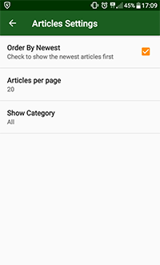

**ArtificialIntelligenceNews**

It's a 6th project made as a part of Android Basics by Google Nanodegree Program.

The application is fetching data from The Guardian API (news about Artificial Intelligence) 
using HTTP Networking, JSON Parsing, AsyncTaskLoader and SharedPreferences.

In order to launch application you need to sign up for The Guardian API key from [here](https://open-platform.theguardian.com/access/)
and place it in your local gradle.properties file under the name `Guardian_ApiKey = "your_key_number"`. 
Gradle.properties file is located:
- in Linux and Mac machine under ~/.gradle/ directory.
- in Windows machine under C:\Users\your_user_name\.gradle\ directory. 
If gradle.properties file is not present under ~/.gradle/ directory then create one.

 
